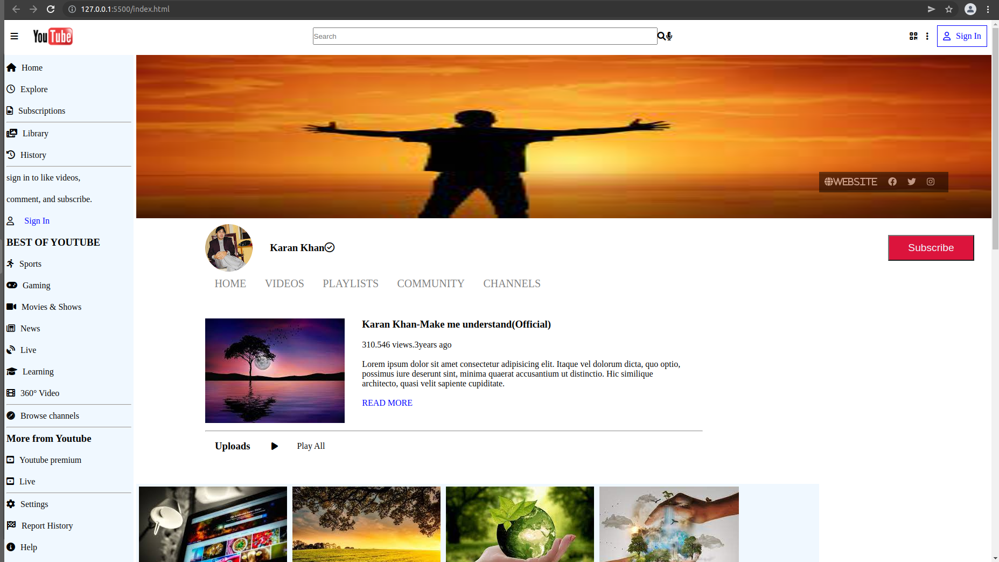
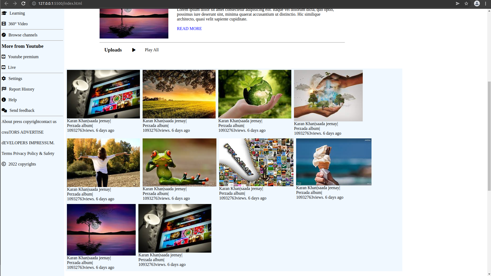

## Youtube page layout

---

---

### About Project

_Youtube page layout was created in order to practice the concept of grid and flex box concepts_

### How to use this Project

_This project can be used to see how grid and flex box concepts can be used to design the layout of a page with more ease_.

##### Developed With

- [x] _HTML5_
- [x] _CSS3_

---

### Contact

Mail: <abadkaka@yahoo.com> 
GitHub: [ahmadshahdarwesh](https://github.com/) 

---

### Used Tools

- [icons](https://www.fontawesome.com)
- [Google Fonts](https://fonts.google.com/)
- [Visual Studio Code](https://code.visualstudio.com/)

---

Made with ❤️ by me
